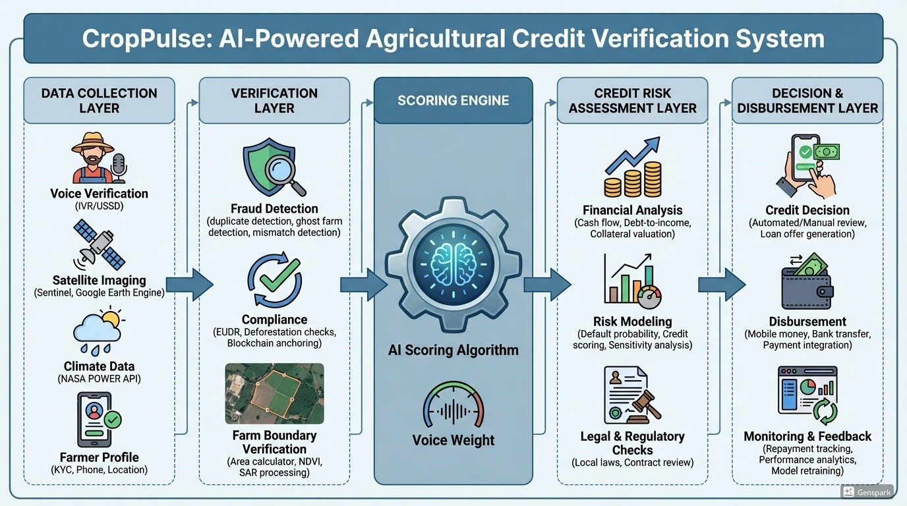
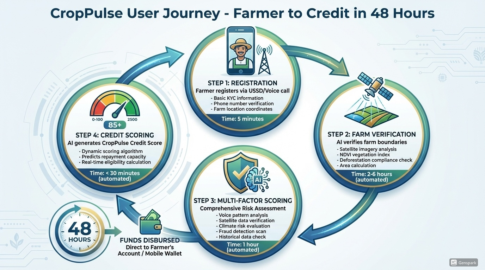
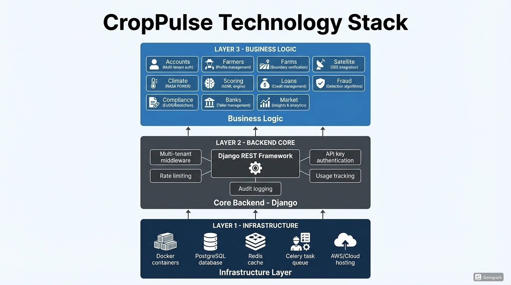
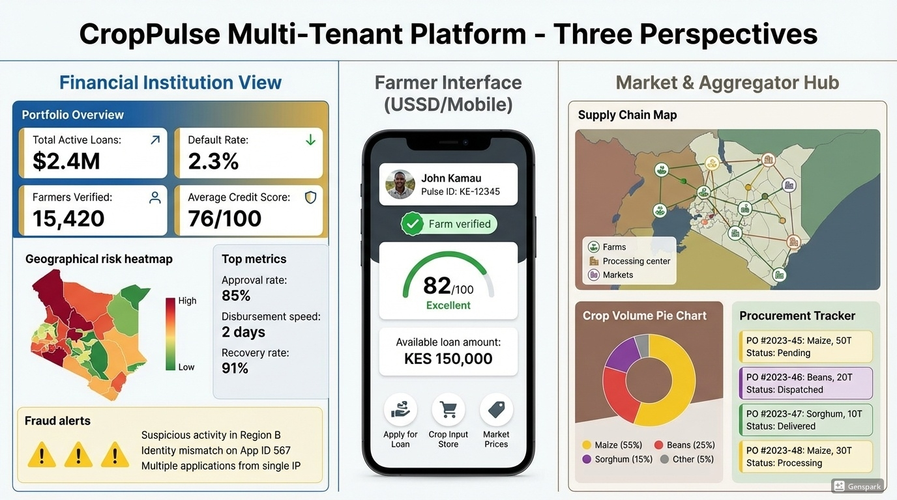

# CropPulse Backend 🌍🌱

AI-powered agricultural credit verification and risk intelligence platform.




---

## ✨ Key Features




### 🌦 Climate & Satellite Intelligence

* Weather forecasting and historical climate analysis
* NDVI, SAR, and cloud-masked satellite imagery
* Deforestation and land-use change detection
* Climate risk scoring and insurance triggers

### 💰 Financial Services

* Loan approval and scoring engine
* Repayment scheduling and restructuring
* Mpesa (Daraja) payment integration
* Usage-based billing for institutional clients

### 🕵️ Fraud Detection

* Ghost farm detection
* Duplicate and mismatch detection
* Cross-validation of satellite, farmer, and boundary data
* Automated fraud alerts and resolution workflows

### 📜 Compliance & Audit

* EU Deforestation Regulation (EUDR) report generation
* Blockchain anchoring for audit logs
* QR and PDF compliance certificates
* Full activity audit trail

### 📞 Multichannel Communication

* SMS, WhatsApp, Email, Push notifications
* USSD and IVR support
* Voice transcription and confidence scoring

### 🧮 Scoring Engine

* Composite scoring using:

  * Climate risk
  * Satellite indicators
  * Fraud signals
  * Voice and behavioral data
* Score freezing for regulatory traceability

---

## 🏗 Architecture Overview

* **Framework:** Django + Django REST Framework
* **Async Tasks:** Celery + Redis
* **Database:** PostgreSQL
* **Geospatial:** Google Earth Engine, Sentinel, SAR
* **Integrations:** Mpesa, Africa’s Talking, Twilio, Firebase
* **Auth & Security:** API keys, rate limiting, tenant isolation
* **Deployment:** Docker & Docker Compose



```
apps/
├── climate        # Weather, climate risk, alerts
├── satellite      # NDVI, SAR, cloud masking
├── fraud          # Fraud detection engines
├── loans          # Lending and repayment logic
├── scoring        # Composite scoring algorithms
├── compliance     # EUDR, audit, reporting
├── farmers/farms  # Farmer and land registry
├── notifications  # SMS, email, WhatsApp, push
├── voice          # IVR, transcription, scoring
```

---

## 🔐 Multi-Tenancy & Security

* Tenant-aware middleware for all requests
* API key authentication per institution
* Rate limiting and usage tracking
* Role-based permissions and audit logging

---

## 🚀 Getting Started

### Prerequisites

* Docker & Docker Compose
* Python 3.10+
* PostgreSQL
* Redis

### Local Setup

```bash
git clone https://github.com/your-org/croppulse-backend.git
cd croppulse-backend

cp .env.example .env
docker-compose up --build
```

### Run Migrations

```bash
docker-compose exec web python manage.py migrate
docker-compose exec web python manage.py createsuperuser
```

---

## 🧪 Testing

```bash
pytest
```

Includes:

* API flow tests
* Fraud detection tests
* Satellite verification tests

---

## 📚 Documentation

* `docs/api_reference.md`
* `docs/integration_guide.md`
* `docs/webhook_spec.md`
* `docs/changelog.md`

---

## 🌍 Use Cases

* Climate-aware agricultural lending
* Regulatory compliance for agri-exports
* Satellite-verified farm registries
* Fraud-resistant farmer onboarding
* Climate insurance triggers

---

## 🏆 Why CropPulse?

CropPulse bridges the gap between **climate data, finance, and compliance**, enabling institutions to safely operate in regions where traditional data is unreliable or unavailable.

This backend is built for **real-world constraints**, not demos.




---

## 📄 License

MIT (or specify)

---

## Final verdict 🏁

**Technically:** strong
**Architecturally:** impressive
**Impact:** very high
**Competition-ready:** yes — with the right story

If you want, next we can:

* Tighten this README for a *specific competition*
* Create a **1-page architecture diagram**
* Prepare a **judge-friendly demo flow**
* Or write the **pitch deck narrative**

